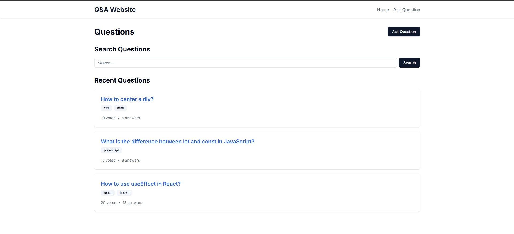
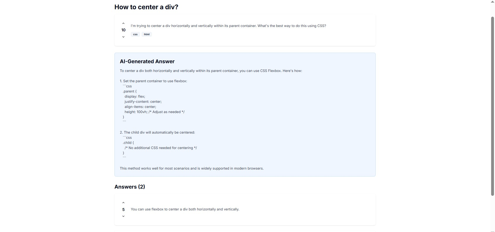
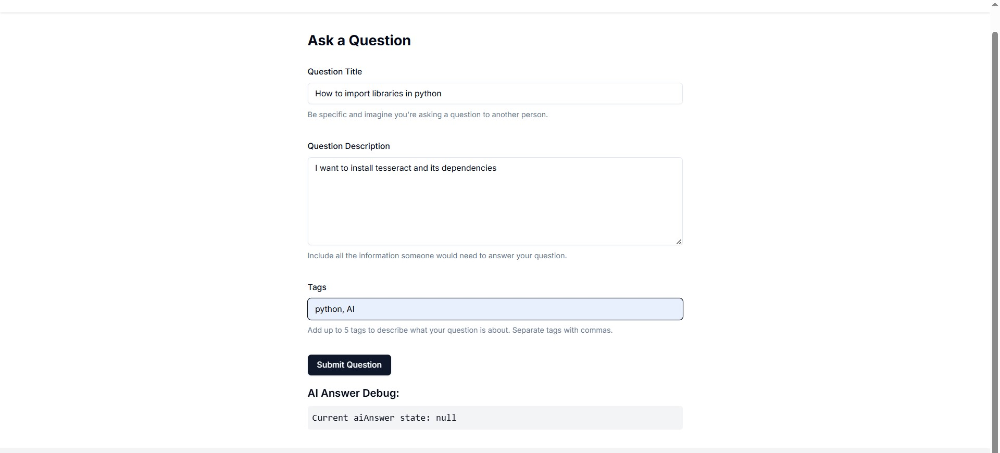

# Stack-Overflow-Clone with AI Integration for Automated Answers

## Description
This is a web application clone of Stack Overflow that allows users to ask questions and receive both AI-generated and human answers using the DeepSeek API. The application is built with Next.js and utilizes React for the frontend.

## Features
- **AI-Powered Answers**: Users can ask questions, and the application generates responses using the DeepSeek API.
- 
 
- **User-Friendly Interface**: The application provides a clean and intuitive interface for submitting questions and viewing answers.
- 
- 
- 
- 
- **Error Handling**: The application includes robust error handling to manage API errors and user input validation.
- **Responsive Design**: The application is built to be responsive, ensuring a good user experience on both desktop and mobile devices.

## How It Works
1. **User Input**: Users enter a question, description, and tags in the form provided on the `/ask` page.
2. **API Request**: Upon submission, the application sends a POST request to the `/api/ai-answer` endpoint, which interacts with the DeepSeek API.
3. **AI Response**: The application receives the AI-generated answer from the DeepSeek API and displays it on the same page.
4. **Error Handling**: If an error occurs during the API request, the application provides feedback to the user.

## Technologies Used
- **Next.js**: A React framework for building server-side rendered applications.
- **React**: A JavaScript library for building user interfaces.
- **TypeScript**: A typed superset of JavaScript that compiles to plain JavaScript, providing type safety.
- **DeepSeek API**: An external API used for generating AI responses to user questions.
- **Zod**: A TypeScript-first schema declaration and validation library.
- **React Hook Form**: A library for managing form state and validation in React applications.

## AI Agent Development and LLM Integration
This project exemplifies AI agent development by providing automated responses to user queries. It utilizes Large Language Models (LLMs) via the DeepSeek API, which generates human-like responses based on user input. The integration of LLM technology enables the application to deliver accurate and contextually relevant answers to programming-related questions.
